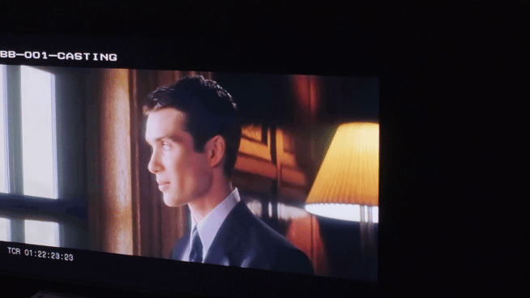
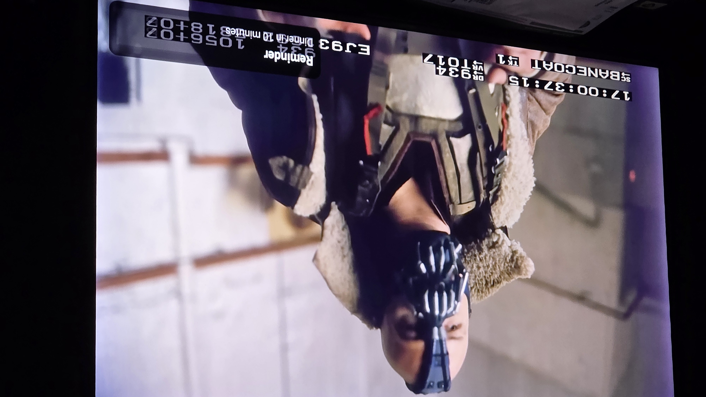
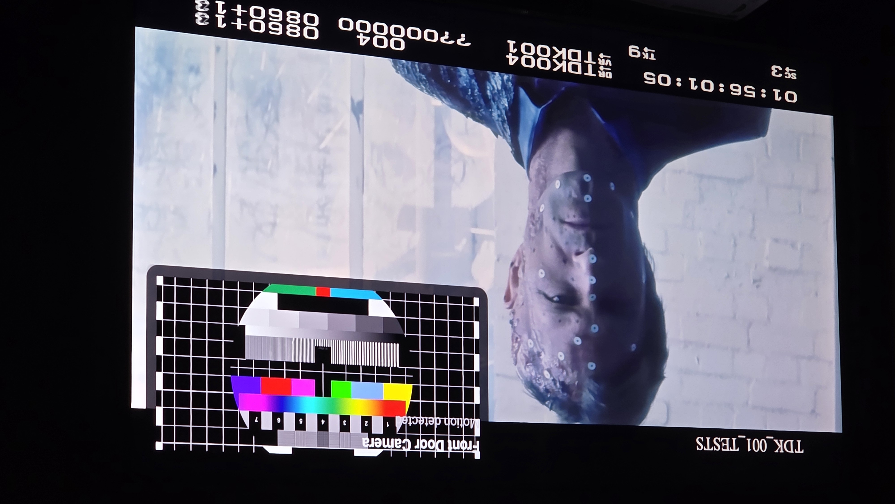

# TvPop

Android TV overlay service for Home Assistant notifications and live streams.


[](https://www.android.com/tv/)

- [What is TvPop](#what-is-tvpop)
- [Demo](#demo)
- [Prerequisites](#prerequisites)
- [Installation](#installation)
- [First Launch & Permissions](#first-launch--permissions)
- [Home Assistant Setup](#home-assistant-setup)
- [API Reference](#api-reference)
- [Debugging](#debugging)
- [Troubleshooting](#troubleshooting)
- [Contributing](#contributing)

---

## What is TvPop

TvPop is a lightweight Android TV service that displays overlays on top of any running application. It listens for incoming HTTP POST requests on your local network and renders text, images, or low-latency video streams. The app is designed to be completely headless after initial setup, responding instantly to triggers from home automation platforms.

It exists to solve the reliability and latency issues found in existing solutions like PiPup, specifically for high-stakes use cases like doorbell cameras. By using a native `SurfaceView` with ExoPlayer and a strictly managed hardware decoder lifecycle, TvPop achieves sub-second latency for HLS and RTSP streams while preventing common failures like "black screen" errors or decoder lockups on Android TV hardware.

## Demo


*Caption: Stream overlay triggered by Home Assistant automation*

| Text                                                | Image                                                 | Stream | Home Assistant YAML |
|:----------------------------------------------------|:------------------------------------------------------| :--- |:--------------------|
|  |  |  | `-`                 |

## Prerequisites

### Android TV device
- Android 10 (API 29) or higher
- Connected to the same network as Home Assistant
- ADB debugging enabled:
  Settings → Device Preferences → About → Android TV OS (click 7 times) → then Settings → Device Preferences → Developer options → USB debugging
- **TV IP Address**: Find it in Settings → Network & Internet → [Your Wi-Fi/Ethernet] → IP address

### Development machine (for sideloading)
- ADB installed and on PATH
- Verify: `adb version`
- Java 17+ (only required if building from source)

## Installation

### Option A: Sideload the release APK (recommended)
1. Download the latest APK from the GitHub Releases page
2. `adb connect <TV_IP>:5555`
3. `adb install -r TvPop.apk`
4. Verify: `adb shell pm list packages | grep tvpop`

### Option B: Build from source
Prerequisites: JDK 17, Android SDK with API 34 build tools
```bash
git clone https://github.com/Ageorge017/TvPop.git
cd TvPop
./gradlew assembleDebug
adb install -r app/build/outputs/apk/debug/app-debug.apk
```

## First Launch & Permissions

1. Launch TvPop from the Android TV home screen.
2. The app will show a permission prompt. TvPop requires the **SYSTEM_ALERT_WINDOW** ("Display over other apps") permission to draw overlays on top of apps like Netflix or YouTube.
3. Navigation steps to grant it:
   Settings → Apps → Special app access → Display over other apps → TvPop → Set to **Allowed**
4. Return to the TvPop app — it will show "TvPop is running" and move to the background.
5. Verify the service is active:
   `adb shell dumpsys activity services com.tvpop`

## Home Assistant Setup

### rest_command configuration
Add the following to your `configuration.yaml`:

```yaml
rest_command:
  # Notification for text, images, or streams
  tvpop_notify:
    url: "http://<TV_IP>:7979/notify"
    method: POST
    content_type: "application/json"
    payload: >
      {
        "media_type": "{{ media_type }}",            # Required: text, image, or stream
        "media_url": "{{ media_url }}",              # Required for image/stream
        "title": "{{ title | default('') }}",        # Optional: Bold header text
        "message": "{{ message | default('') }}",    # Optional: Secondary text
        "duration": {{ duration | default(15) }},    # Optional: Seconds (0 defaults to 15)
        "position": "{{ position | default('bottom_right') }}", # top_left, top_right, bottom_left, bottom_right
        "width": {{ width | default(320) }},         # Optional: Width in DP
        "background_color": "{{ background_color | default('#CC000000') }}" # Optional: ARGB Hex
      }

  # Immediately clear any active overlay
  tvpop_cancel:
    url: "http://<TV_IP>:7979/cancel"
    method: POST
```

### Example automations

**1. Show a live camera stream when a doorbell is pressed**
```yaml
automation:
  - alias: "Doorbell Stream Overlay"
    trigger:
      - platform: state
        entity_id: binary_sensor.doorbell_button
        to: "on"
    action:
      - service: rest_command.tvpop_notify
        data:
          media_type: "stream"
          media_url: "rtsp://192.168.1.50/stream"
          title: "Front Door"
          message: "Someone is at the door"
          position: "top_right"
          duration: 30
```

**2. Show a text notification when an alarm is triggered**
```yaml
automation:
  - alias: "Alarm Notification"
    trigger:
      - platform: state
        entity_id: alarm_control_panel.home_alarm
        to: "triggered"
    action:
      - service: rest_command.tvpop_notify
        data:
          media_type: "text"
          title: "ALARM TRIGGERED"
          message: "Intrusion detected in Living Room"
          background_color: "#CCFF0000"
          duration: 15
```

**3. Cancel the overlay when a condition clears**
```yaml
automation:
  - alias: "Cancel Overlay on Motion Stop"
    trigger:
      - platform: state
        entity_id: binary_sensor.front_door_motion
        to: "off"
        for: "00:00:10"
    action:
      - service: rest_command.tvpop_cancel
```

### Network requirements
- TvPop listens on port **7979**.
- Test reachability from HA: Developer Tools → Services → `rest_command.tvpop_cancel`.
- **VLANs/Firewalls**: Ensure port 7979 is open between the Home Assistant server and the TV.

## API Reference

### POST /notify
| Name | Type | Required | Default | Description |
| :--- | :--- | :--- | :--- | :--- |
| `media_type` | String | **Yes** | - | `text`, `image`, or `stream`. |
| `media_url` | String | Conditional | - | Required if `media_type` is `image` or `stream`. |
| `title` | String | No | `""` | Bold header text. |
| `message` | String | No | `""` | Secondary descriptive text. |
| `duration` | Int | No | `15` | Seconds before auto-dismissal. `0` defaults to 15. |
| `position` | String | No | `"bottom_right"` | `top_left`, `top_right`, `bottom_left`, `bottom_right`. |
| `width` | Int | No | `320` | Width of the card in DP. |
| `corner_radius`| Float | No | `12.0` | Corner rounding in DP. |
| `background_color`| String | No | `"#CC000000"`| Hex ARGB background color. |
| `title_color` | String | No | `"#FFFFFF"` | Hex ARGB title color. |
| `message_color` | String | No | `"#CCCCCC"` | Hex ARGB message color. |

### POST /cancel
Dismisses any active overlay immediately.
```bash
curl -X POST http://<TV_IP>:7979/cancel
```

### Response envelope
Success:
```json
{"ok": true}
```
Error:
```json
{"ok": false, "error": "unsupported_media_type"}
```

| Error Code | Meaning | HTTP Status |
| :--- | :--- | :--- |
| `invalid_json` | Malformed JSON or type mismatch. | 400 |
| `unsupported_media_type`| `media_type` is missing or unknown. | 400 |
| `media_url_required` | `image` or `stream` requested without a `media_url`. | 400 |
| `overlay_permission_denied`| App lacks "Display over other apps" permission. | 500 |
| `unknown_error` | Unexpected internal server error. | 500 |

### curl examples
```bash
# Text notification
curl -X POST http://192.168.1.100:7979/notify \
  -H "Content-Type: application/json" \
  -d '{"media_type":"text","title":"Hello","message":"World"}'

# Image overlay
curl -X POST http://192.168.1.100:7979/notify \
  -H "Content-Type: application/json" \
  -d '{"media_type":"image","media_url":"https://example.com/photo.jpg","title":"Person detected"}'

# Live Stream
curl -X POST http://192.168.1.100:7979/notify \
  -H "Content-Type: application/json" \
  -d '{"media_type":"stream","media_url":"rtsp://192.168.1.50/stream","title":"Front Door"}'
```

## Debugging

**View live logs**
```bash
adb logcat -s TvPop
```

**Test the HTTP server from your laptop**
```bash
curl -X POST http://<TV_IP>:7979/notify \
  -H "Content-Type: application/json" \
  -d '{"media_type":"text","title":"Test","message":"Hello"}'
```

**Verify the service is alive**
```bash
adb shell dumpsys activity services com.tvpop
```

**Check overlay permission status**
```bash
adb shell appops get com.tvpop SYSTEM_ALERT_WINDOW
```

## Troubleshooting

| Symptom | Likely cause | Fix |
| :--- | :--- | :--- |
| Overlay does not appear after APK reinstall | System revoked "Display over other apps" permission. | Re-verify and grant permission in Settings → Apps → Special app access. |
| Stream shows a black frame for 2-3 seconds on first load | ExoPlayer surface initialization race or codec warm-up. | Initialization is deferred via `root.post` to mitigate this. |
| HTTP server stops responding after the TV has been idle | Android TV launcher killed background service for memory. | Service uses `START_STICKY` and foregrounding; check battery settings. |
| curl returns "connection refused" | App not running, port conflict, or firewall. | Launch TvPop; check logcat for `BindException` on port 7979. |
| Overlay appears but stream is choppy or high latency | Incompatible codec/profile or buffer bloat. | Ensure stream uses H.264/H.265; see [ARCHITECTURE.md](docs/ARCHITECTURE.md#adr-005-idempotency-strategy-media-url-match). |

## Contributing

- Please read [docs/ARCHITECTURE.md](docs/ARCHITECTURE.md) before making changes — it documents decisions that must be preserved.
- Found a bug? Open an issue on [GitHub](https://github.com/yourusername/TvPop/issues).
- See [CONTRIBUTING.md](CONTRIBUTING.md) for development guidelines.
